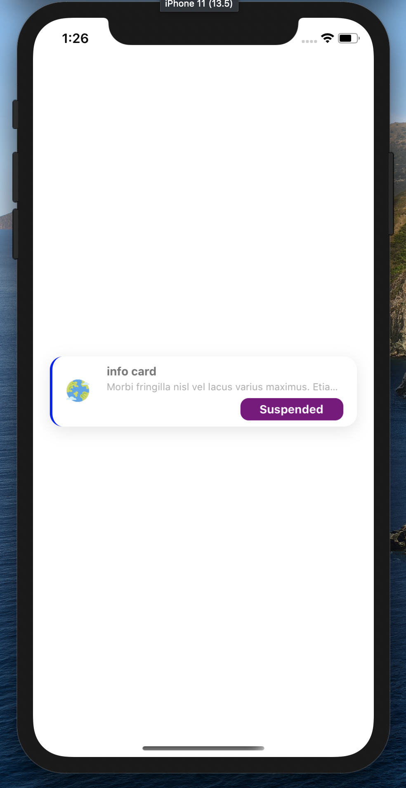

[](https://github.com/WrathChaos/react-native-library-boilerplate)

[](https://github.com/WrathChaos/react-native-library-boilerplate)

[](https://www.npmjs.com/package/react-native-library-boilerplate)
[](https://www.npmjs.com/package/react-native-library-boilerplate)

[](https://opensource.org/licenses/MIT)
[](https://github.com/prettier/prettier)

<p align="center">
  
</p>

# Installation

Add the dependency:

```ruby
npm i @paraboly/react-native-info-card
```

## Peer Dependencies

###### IMPORTANT! You need install them

```js
"react": ">= 16.x.x",
"react-native": ">= 0.55.x",
"react-native-androw": ">= 0.0.34",
```

# Usage

## Import

```js
import InfoCard from "@paraboly/react-native-info-card";
```

## Component1 Usage

```js
<InfoCard />
```

## Future Plans

- [x] ~~LICENSE~~
- [ ] Write an article about the lib on Medium

# Change Log

Change log will be here !

## Author

Sevval Eygul, sevvalleygull@gmail.com

## License

React Native Library Boilerplate is available under the MIT license. See the LICENSE file for more info.
